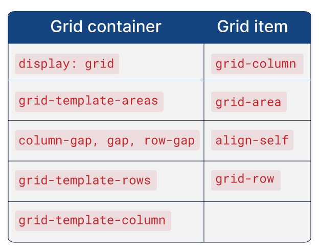
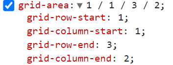

# Praticando CSS: Grid e Flexbox

## Aula 01 - Hello Flex!

### Aula 01 - Apresentação - Video 1

Nesta aula do curso "Praticando CSS com Grid e Flexbox", os instrutores Beatriz e Luan apresentam o conteúdo do curso. Eles explicam que o curso é voltado para aqueles que desejam aprender a utilizar o Flexbox e o Grid para dispor elementos em uma página HTML. O projeto Culturama será desenvolvido ao longo do curso, com foco em três telas principais: mobile, tablets e desktops. Durante o curso, serão abordados elementos como cabeçalho, seção de banner, categorias, destaques, próximos eventos, coloque na sua agenda e rodapé. É importante ter realizado os cursos indicados como pré-requisitos para ter uma base sólida e poder aplicar os conhecimentos adquiridos em outros projetos.

### Aula 01 - Combo do Flex - Video 2

Nesta aula do curso "Praticando CSS: Grid e Flexbox", o instrutor Luan introduz os conceitos de Flexbox e Grid, que são tecnologias utilizadas no desenvolvimento Front-end. Ele mostra como abrir o projeto no VS Code e como criar um arquivo flex.css para organizar o cabeçalho do projeto Culturama usando o Flexbox. São aplicadas diversas propriedades do Flexbox, como display, justify-content, align-items, flex-wrap e column-gap, para criar um layout responsivo. O instrutor também menciona a extensão Live Server para visualizar o projeto no navegador.

### Aula 01 - Alinhando eixos - Video 3

Nesta aula, o Luan discute sobre a finalização do cabeçalho para celulares do projeto Culturama e a organização dos elementos para telas de tablets. Ele menciona a necessidade de alinhar a logo e o botão "Seu local" com as margens da página. O Luan mostra o código no arquivo flex.css e explica o uso da instrução @media para aplicar estilos apenas para telas de pelo menos 720 pixels de largura. Ele utiliza o "Inspecionar" do navegador para auxiliar na construção do layout. O Luan aumenta o column-gap para expandir o espaçamento entre os itens, movendo a logo para a esquerda e o botão "Seu local" para a direita. Ele conclui que 75px é um valor adequado para alinhar os elementos. O código atualizado no @media chama a classe .menu e aplica a propriedade column-gap com o valor de 75 pixels. O Luan compara o layout do Figma com o resultado obtido e conclui que o cabeçalho para telas de tablets está finalizado.

### Aula 01 - Para saber mais: propriedade gap

A propriedade gap do flexbox e grid, é utilizada para aplicar distância no sentido horizontal e vertical entre elementos em um layout, sua função é similar à propriedade margin.

column-gap  
A propriedade column-gap serve para criar uma lacuna vertical entre elementos.

row-gap  
Já a propriedade row-gapserve para criar uma lacuna horizontal entre elementos.

gap  
E caso você utilize simplesmente a propriedade gap, ela irá criar espaçamentos tanto no sentido vertical quanto horizontal.

### Aula 01 - Para saber mais: Flex e Grid - direções invertidas

Trabalhando com Linhas e Colunas
No flex, quando utilizamos a propriedade flex-direction: row, estamos organizando os elementos um ao lado do outro, trabalhando com o eixo x ou horizontal.

Já no grid, quando utilizamos a propriedade grid-template-rows estamos calculando a altura das linhas e consequentemente, modificamos o eixo y ou vertical.

O mesmo ocorre com as colunas, no flex a propriedade flex-direction: column dispõe os elementos um abaixo do outro, ou seja, no eixo y ou vertical.

E no grid, a propriedade grid-template-columns serve para criar e calcular a largura das colunas, sendo assim, estamos alterando o eixo x ou horizontal.

### Aula 01 - Container x Item - Video 4

Nesta aula, o instrutor Luan finaliza o cabeçalho do projeto Culturama, focando nas telas de desktops. Ele utiliza as propriedades do Flexbox para corrigir a ordem dos elementos e garantir que fiquem alinhados na mesma linha. Ele também utiliza a propriedade order para reordenar os elementos do cabeçalho. Além disso, Luan menciona que o Grid será utilizado para o banner na parte inferior.

### Aula 01 Conclusão - Nessa aula, você aprendeu como:

Organizar elementos com display flex;
Entendeu qual o eixo padrão dos itens flex;
Aprendeu como organizar grupos de itens na horizontal e vertical;
Diferenciar flex-item e flex-container.

## Aula 02 - Play no Grid

### Aula 02 - Display: Grid - Video 1

Nesta aula, a professora Beatriz explica como trabalhar com o grid container banner no Figma do Culturama. Ela menciona que o grid container possui duas colunas e três linhas, e aloca quatro elementos que atuam como grid items. A professora mostra como adicionar o espaçamento entre as linhas e colunas e posicionar cada grid item corretamente. Ela também menciona que o navegador não consegue adivinhar a posição de cada item e pede a ajuda dos alunos para passar essa informação ao navegador.

### Aula 02 - Para saber mais: Container vs Grid item

Um elemento passa a ser interpretado como um grid container, a partir do momento em que é aplicado nele a propriedade display:grid, a partir disso, cada elemento filho direto passa a ser visto como um grid item.

Esses termos são de fundamental importância pois existem propriedades que obrigatoriamente devem ser aplicadas ao elemento pai (Grid Container) e outras que devem ser aplicadas exclusivamente ao elemento filho (Grid Item).

### Aula 02 - Grid Lines - Video 2

Nesta aula, a instrutora Beatriz explica como posicionar elementos em um grid utilizando as propriedades grid-column e grid-row. Ela mostra um exemplo de código onde define as posições de dois elementos de um banner. A propriedade grid-column define as colunas que o elemento irá ocupar, enquanto a propriedade grid-row define as linhas. Beatriz destaca que é importante contar as "grid lines" ao determinar as posições. Ela também menciona que a disposição do banner pode variar de acordo com a resolução da tela.

### Aula 02 - Trocando a posição dos Grid Items - Video 3

Nesta aula, Beatriz explica sobre o posicionamento dos itens no Figma em diferentes tamanhos de tela. Ela destaca que ao aumentar a tela para 720 pixels, é necessário passar essa informação para o navegador. Ela mostra como utilizar o media query para definir o estilo dos elementos para telas acima de 720 pixels. Beatriz também mostra um exemplo de código onde é feita a modificação do posicionamento das imagens no grid container. Após as alterações, os elementos ficam na posição correta para telas acima de 720 pixels.

### Aula 02 - Para saber mais: compactando e detalhando

Detalhando com start e end
Você sabia que as propriedades grid-column e grid-row são abreviações de outras duas propriedades?

E podemos obter o mesmo resultado desse código, de uma maneira mais detalhada, utilizando o start e o end, veja:  
Exemplo:
.imagem-amarela {
    grid-column-start: 1;
    grid-column-end: 2;
    grid-row-start: 1;
    grid-row-end: 3;
}
O start irá pegar o primeiro valor do grid-column e grid-row e o end receberá o segundo valor dessas propriedade.

Compactando com grid-area
O grid-column e o grid-row possuem informações compiladas, mas é possível condensar ainda mais, com o uso da propriedade grid-area.  
O código fica assim:
.imagem-amarela {
    grid-area: 1 / 1 / 3 / 2
}
A propriedade grid-area irá admitir os 4 valores relacionados ao grid-column e grid-row, mas um ponto muito importante é respeitar a ordem desses valores, que pode ser visualizada na ferramenta do desenvolvedor.

> O valor do end será sempre um número a mais que o número das linhas e colunas que o elemento ocupa.

### Aula 02 Conclusão - Nessa aula, você aprendeu como:

Trazer o contexto do grid para um container por meio do display: grid;
Realizar a contagem das linhas do grid horizontais e verticais;
Definir o posicionamento inicial e final de um grid item em relação às linhas e colunas do layout.

## Aula 03 - 

### Aula 03 -  - Video 1
